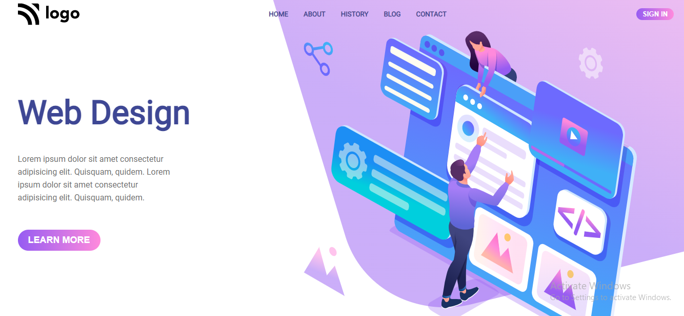

# Project 8 :- Design Landing Page

### What I Learned from this Project?

- Learned to use flex grow, shrink & basis
- Learned to create linear-gradient background color

### This project took around 3 hours to complete.

### Project Link : [Link](https://proj8-design-landing-page.netlify.app/)

### Screenshot

